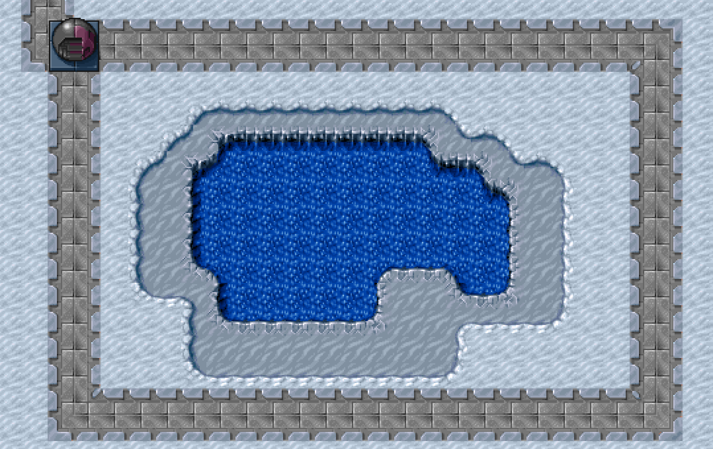

# One Golden Sun

One Golden Sun is based on Disney’s “It’s a Small World”, a song about global cooperation written in the wake of the Cuban Missile Crisis:

```
There is just one moon and one golden sun
And a smile means friendship to everyone
Though the mountains divide and the oceans are wide
It's a small world after all
```

The year is 2100 and earth's heavy energy use is mostly supported by high-efficiency solar collectors orbiting the sun, which send the power via "tight-beams" to receiver stations on the planet.

5 days ago, two aggressive nations deployed dozens of coordinated attacks that destroyed all but one of these receiver stations, crippling the world's leading nations.

A century of growing nationalism had dissolved much international cooperation but now we must share what little energy we have to combat the threat. It is up to you to build power lines between the one remaining receiver station and the other nations of the world, so that we can share what little power we have and use it in our defense against the alliance of aggressive nations.

But be warned: as you build, enemy aircraft will attack and destroy your work. To defend against this, you can build anti-aircraft turrets and man these turrets to shoot down the attacking planes.

Almost all the game art is by [Daniel Cook](http://www.lostgarden.com/). It was originally for an unreleased real-time strategy game called Hard Vacuum in 1993 and was [donated to the public in 2005](http://lunar.lostgarden.com/game_HardVacuum.htm). The one exception is the enemy fighter ships, which is created by ship modules by [Skorpio](http://opengameart.org/users/skorpio) that were [assembled by wubitog](https://opengameart.org/content/spaceship-fighter-ipod1). I just did a little editing to try to make it fit in better with the Hard Vacuum artwork.

The game will be hosted at https://github.com/prust/one-golden-sun.

Here's a screenshot:



TODO:

* Attacks by enemy fighters
* Ability to shoot down enemy fighters
* Fighters should be able to shoot or bomb roads and turrets
